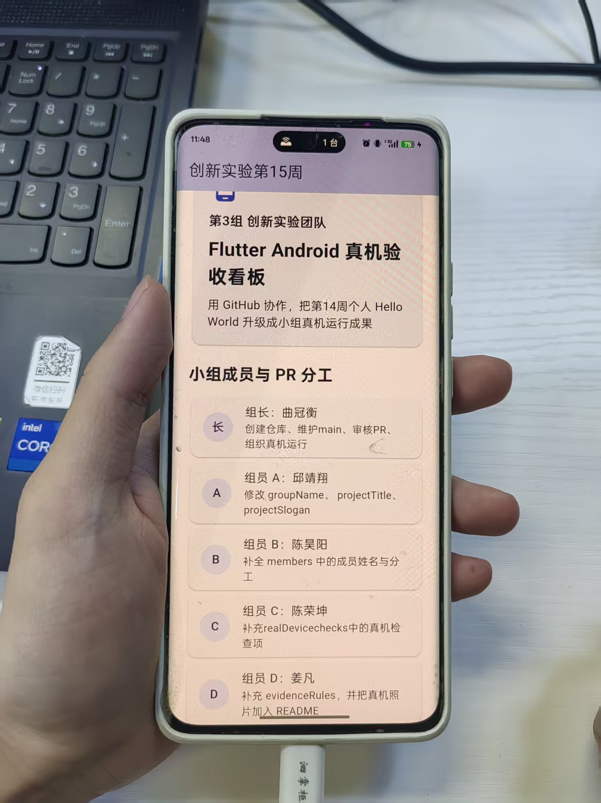

# 创新实验第15周：团队协作与 Android 真机运行示例

本项目用于第15周课堂任务：在第14周 Flutter Hello World 和 GitHub 提交练习的基础上，本小组通过 Pull Request 协作修改同一个 Flutter 项目，并把最终版本运行到真实 Android 手机上。

<br />

## 小组成员

- 曲冠衡（本次实验代理组长）
- 邱靖翔
- 陈昊阳
- 陈荣坤
- 姜凡
- 周文斌

## 项目结构

```
innovation-week15-team3-device/
├── lib/
│   └── main.dart              # Flutter 主程序文件
├── images/
│   └── android-real-device.jpg # 真机运行照片
├── test/
│   └── widget_test.dart       # 组件测试文件
├── android/                   # Android 平台配置
├── pubspec.yaml               # 项目依赖配置
└── README.md                  # 项目说明文档
```

## 协作方式

本周统一使用 Fork + Pull Request：

```text
组长创建原始仓库
  ↓
组员 Fork 到自己的 GitHub
  ↓
组员 clone 自己的 Fork
  ↓
组员创建个人分支并修改指定区域
  ↓
组员 push 到自己的 Fork
  ↓
组员向组长仓库提交 Pull Request
  ↓
组长 Review 并合并
  ↓
主电脑运行合并后的最终版本
```

<br />

## 小组分工

| 角色 | 修改位置 | 任务 |
| --- | --- | --- |
| 曲冠衡（本次实验代理组长） | GitHub 仓库 | 创建仓库、维护 `main`、审核 PR、组织真机运行 |
| 邱靖翔 | `lib/main.dart` | 修改 `groupName`、`projectTitle`、`projectSlogan` |
| 陈昊阳 | `lib/main.dart` | 补全 `members` 中的小组成员姓名与分工 |
| 陈荣坤 | `lib/main.dart` | 补充 `realDeviceChecks` 中的真机检查项 |
| 姜凡 | `lib/main.dart` 和 `README.md` | 补充 `evidenceRules`，提交真机照片说明 |
| 周文宾 | `lib/main.dart` 和 `README.md` | 定期备份仓库和分支，辅助审核PR |

## 实验过程

##### 运行命令

进入项目根目录后执行：

```bash
flutter pub get
flutter test
flutter run
```

查看设备：

```bash
flutter devices
```

指定真实 Android 手机运行：

```bash
flutter run -d 设备ID
```

##### Android 真机检查

连接手机后先检查：

```bash
adb devices
flutter devices
```

`adb devices` 的状态为：

```text
device
```

<br />

## 本组真机运行照片



